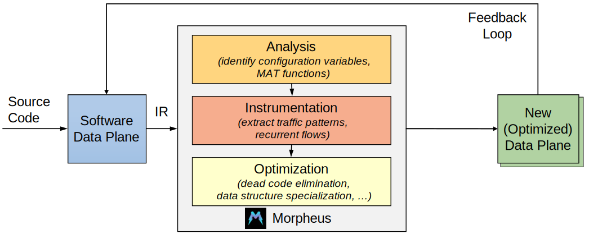

# Morpheus: Domain Specific Run Time Optimization for Software Data Planes

[](https://github.com/Morpheus-compiler/Morpheus/actions/workflows/morpheus-build.yml)
[](https://github.com/Morpheus-compiler/Morpheus/actions/workflows/morpheus-pktgen-build.yml)
[](https://doi.org/10.5281/zenodo.5828422)

Morpheus is a system working alongside static compilers that continuously optimizes the targeted networking code. 
It introduces a number of new techniques, from static code analysis to adaptive code instrumentation, together with a toolbox of domain specific optimizations used to manipulate the code on-the-fly depending on runtime traffic patterns and control plane configurations.

<p align="center">

</p>
<p align="center">
<sub>Morpheus compilation pipeline.</sub>
</p>

The Morpheus core exploits the **LLVM compiler** toolchain (v10.0.1) for code manipulation and run-time code generation. It works at the *intermediate representation* (IR) level as it allows to reason about the running code using a relatively high-level language framework without compromising on code generation time.

The Morpheus compilation pipeline comprises three main steps:
1. **Code Analysis**: In the first pass, Morpheus uses ***static code analysis*** to identify all map access sites in
the code, understand whether a particular access is a read or a write operation, and reason about the way the result is
used later in the code. In particular, signature-based call site analysis is used to track map lookup and update calls, and then a combination of ***memory dependency analysis*** and ***alias analysis*** is performed to match map lookups to map updates.
2. **Instrumentation**: In the second pass, Morpheus profiles the dynamics of the input traffic by generating ***heatmaps*** of the maps’ access patterns, so that the collected statistics can then be used to drive the subsequent optimization passes.
3. **Optimization Passes**: The third step of the compilation pipeline is where all online code transformations are applied (e.g., *JIT compilation*, *Dead code elimination*, *Constant Propagation*, *Guard Elision*). 

For more information, please read the Morpheus's [paper](https://sebymiano.github.io/publication/2022-morpheus/2022-morpheus.pdf) and the [extended abstract](https://sebymiano.github.io/publication/2022-morpheus/2022-morpheus_abstract.pdf) accepted to [ASPLOS '22](https://asplos-conference.org/2022/).

## Compile and run Morpheus

### eBPF Plugin
Morpheus leverages the [Polycube](https://sebymiano.github.io/publication/2021-polycube/2021-polycube.pdf) framework as an eBPF backend to manage chains of in-kernel packet processing programs.
Polycube readily delivers almost all the needed components for an eBPF backend. We extended the original Polycube framework with [our custom version](https://github.com/Morpheus-compiler/polycube) (original repo is [here](https://github.com/polycube-network/polycube)), and we added a mechanism for updating the data plane program on-the-fly and defined templates to inject guards.

Most of the Morpheus compilation toolchain is instead implemented inside the [BCC framework](https://github.com/iovisor/bcc) (our custom version is [here](https://github.com/Morpheus-compiler/bcc)).

### Installation

To install Morpheus, you can use the script `setup_dut.sh` provided in this repository.
It will download all the dependencies and the required files, and it will install the *Polycube* framework with **Morpheus** support.

```console
$ git clone https://github.com/Morpheus-compiler/Morpheus.git --recursive # Not needed if you downloaded the archive from Zenodo
$ cd Morpheus
$ ./setup_dut.sh
```

**Note: All the scripts and results have been performed with Ubuntu 20.04 and kernel version 5.12. You can still install Morpheus even if your kernel version is lower, but the results may be different from the one presented in the paper.**

If you want to upgrade your kernel, you can follow [this](https://polycube-network.readthedocs.io/en/latest/installation.html#updating-linux-kernel) guide.

### Run Morpheus
In this section we provide instructions to run Morpheus with a sample eBPF service (e.g., the router), just to see it up and running (in case you do not trust us!).
For all the experiments presented in the paper please look at Section [*Experiments*](#experiments), which however require a careful testbed preparation.

After Morpheus is installed, you can start the Polycube daemon (i.e., *polycubed*) and create new services.

### Example of Morpheus optimizer (Router service)
[](https://github.com/Morpheus-compiler/Morpheus/actions/workflows/morpheus-test.yml)

We provide here an example of how Morpheus works. This setup does not requires testbed preparation, and it can be executed on a single machine.
It uses two namespaces and attaches the Polycube eBPF *router* Network Function (NF) to the *Traffic Control* (TC) hook of the *veth* interfaces connected to the namespaces.

To run this example, follow these instructions:

1. Now open a new terminal, and type the following command to start the Polycube daemon:
```console
$ sudo polycubed
```
after few seconds, the *Polycube* daemon will start and it will load a set of NFs.

2. Now go on another terminal, and run the test:
```console
$ cd experiments/router/simple
$ sudo ./router-simple-start.sh
```

This test will first create the containers and instantiate the Router service. At a given point, it will ask the user to start sending the PCAP trace from the first to the second namespace, and it will print the throughput before and after *Morpheus* is enabled.
You will notice that, when *Morpheus* is active the throughput will start increasing as soon as the traffic-level optimizations are applied.

## Experiments

In addition to the previously presented experiment, which allows to run the first simple application under Morpheus, we provide [`experiments/`](./experiments) folder that covers all the conducted experiments in the paper. The folder contains a [`README.md`](./experiments//README.md) file with all the instructions needed to set up the testbed, generate the trace used for the tests, produce the results and create the final figures.

**Please note that all the experiments require two servers connected back-to-back with 2 different interface. The first server is used as packet generator (uses DPDK), while the second is used as Device Under Test (DUT) and runs the data plane application together with the *Morheus* compiler/optimizer.**

## Need help?

If you have problems installing the code or executing the scripts available in this repo, please open an issue. 
If you have other question about the code or the paper, contact [Sebastiano Miano](https://sebymiano.github.io) (`s.miano at qmul.ac.uk`).
