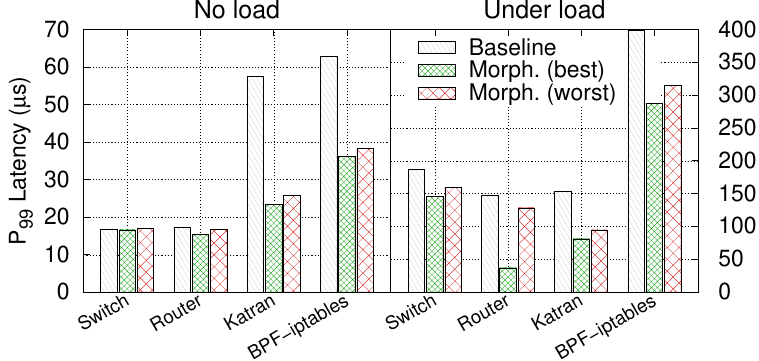

# Experiments

Under this folder you can find scripts to run some experiments performed in our ASPLOS '22 [paper](https://sebymiano.github.io/publication/2022-morpheus/2022-morpheus.pdf).

Here you can find a list of all the experiments. Every folder contains an additional `README.md` with the instructions to run the single experiment.

## Table of Contents
1. [Testbed setup](#testbed-setup)
2. [List of experiments](#list-of-experiments)
   1. [Throughput (Figure 4)](#1-baseline-vs-morpheus-throughput-figure-4)
   2. [Perf (Figure 5)](#2-perf-measurement--figure-5)
   3. [Latency (Figure 6)](#3-latency-experiments-figure-6)
   4. [Naive vs Adaptive instrumentation (Figure 7)](#4-naive-vs-adaptive-instrumentation-experiments-figure-7)
   5. [Instrumentation overhead (Figure 8)](#5-instrumentation-overhead-experiments-figure-8)
   6. [Experiment with dynamic traffic (Figure 9a)](#6-experiment-with-dynamic-changing-traffic-figure-9a)

## Testbed setup
Our testbed is composed of two servers. The first one works as packet generator and uses DPDK to send packets at maximum speed. Both servers are connected back-to-back as indicated in the underlying figure.

We use a modified version of the [`dpdk-burst-replay`](https://github.com/sebymiano/dpdk-burst-replay/tree/morpheus) tool to replay large PCAP traces (e.g., CAIDA), and [`Moongen`](https://github.com/emmericp/MoonGen) for the latency experiments, since it is able to exploit the hardware timestamp of the NIC instead of the software one.

<p align="center">

</p>
<p align="center">
<sub>Testbed setup</sub>
</p>

### Hardware & Software requirements
The testbed needed to run the experiments in this repo requires two servers with two *separate* Ethernet interfaces connected back-to-back, as shown in the Figure above. In particular:

#### **Packet generator server**
This server runs all the script to start the tests and collect the results from the DUT (via SSH, if configured). The requirements for this server are:
- DPDK v20.11.3 (or newer)
- At least 10G of *large* hugepages (1G each) required to send large PCAPs
- Two *ethernet* interfaces connected back-to-back with the *DUT* and one additional interface to perform the connection (via SSH) with the DUT (in our paper we used one *Intel Intel XL710* 40Gbps dual port NIC).

#### **DUT server**
In this server, we run the tests. The script executed on the *packet generator* server automatically collects the results and manages the lifecycles of the test via a separate SSH connection with the DUT.
The requirements for this server are:
- At least kernel v5.10 (the paper's test have been performed on kernel v5.12)
- Two *ethernet* interfaces connected back-to-back with the *Packet generator* and one additional interface to perform the connection (via SSH) with the *Packet generator* (in our paper we used one *Intel Intel XL710* 40Gbps dual port NIC).
- Both interfaces should have the possibility to set hardware rules in the NIC to redirect packets to a single core. The [script](common/setup_flow_director_single_core.sh) that performs this operation prints a warning in case this is not supported, and continue the configuration. You can run the test anyway, but the results will be different from the one presented in the paper.
You can check if your interface supports this operation with the following command:
```console
# sudo ethtool -k <if> | grep "ntuple-filters: on"
```
If the command does not produce any output, the operation is not supported.
- The driver used by the two interface should be compatible with *XDP Native* mode. You can check [here](https://github.com/xdp-project/xdp-project/blob/master/areas/drivers/README.org) the list of supported drivers.
- The `bpf_jit_enable` flag enabled on the kernel (this should be enabled by default on recent kernel, e.g. v4.18+)

### Run experiments on Cloudlab
To further simplify the reproducibility of our experiments, in case you do not have the required hardware available, we provide a [Cloudlab](https://www.cloudlab.us/) profile ready to use. The profile is available on this repository [here](../profile.py).

Running the experiment on Cloudlab is very easy. Just follow these steps:
1. Login to [Cloudlab](https://www.cloudlab.us/login.php) using your username and password
2. Go to `Experiments` > `Create Experiment Profile` on the left tab (or follow directly [this](https://www.cloudlab.us/manage_profile.php) link).
3. Import the `Morpheus` profile by clicking on the `Git Repo` button, and paste the URL of this repository (i.e., https://github.com/Morpheus-compiler/Morpheus.git).
4. Wait for Cloudlab to clone the repository and import the profile. Once done, you an directly `Instantiate` it by clicking on the corresponding button.
5. Once you instantiate the experiment, you an setup a hardware node type. We already provide a default type (i.e., `c220g1`) but you can use another (we only tested it on `c220g1`).
***Note:*** Althought `c220g1` hardware nodes are *similar* to our paper's testbed, it is not the same; the absolute results may be different, but the **Morpheus** behavior should be evident.
6. After the experiment is instantiated, you just need to wait for the setup to complete; then you can click on the `List View` tab to read the `ssh` command to log into the servers.
7. After you login into the servers, make sure you reboot them before running our experiments, so that our custom configuration will be applied (e.g., the `DUT` will start with kernel `v5.12`).
8. After the reboot, log into the `pktgen` machine, clone the Morpheus repository and run the `setup_pktgen.sh` script.
9. In the meantime, log into the `dut` machine, clone the Morpheus repository and run the `setup_dut.sh` script.
10. At this point, you are ready to start. Follow the instructions below to run our experiments. Enjoy *Morpheus*!

### Install dependencies
Before starting, you need to prepare the testbed with all the required software.
Log in into the server that work as packet generator and execute the following commands.
<!---
We suggest to use the [*automatic*](#automatic-installation) installation script, but if you have problems you can go with the [*manual*](#manual-installation) installation:
-->

#### Automatic installation
After installing all the dependencies and the software required for the packet generator, it will ask if you want to setup the `hugepages` and the PCI address of the NIC interfaces to be bound to the DPDK `vfio-pci` driver.

If the script fails in this last step, make sure you have `intel_iommu=on` flag enabled on your *GRUB* settings; if not, you can add this *flag* under `GRUB_CMDLINE_LINUX_DEFAULT`; then run `sudo update-grub` and *reboot* your server.

```console
$ git clone https://github.com/Morpheus-compiler/Morpheus.git # Not needed if you downloaded the archive from Zenodo
$ ./setup_pktgen.sh
```

### PCAP Trace Generation
Most of the experiments in our paper have been performed using either [*CAIDA*](https://www.caida.org/catalog/datasets/passive_dataset_download/) traces and *synthetic* traces with different traffic locality, generated using [ClassBench](https://www.arl.wustl.edu/classbench/).

To simplify the reproducibility of our experiments, we also provide such traces under the [GIT Release of this repo](https://github.com/Morpheus-compiler/Morpheus/releases/tag/v0.1).
<!---
You have two options here. If you trust us, you can download our traces, otherwise we provide a script to generate them automatically (although this would take ~1 hour to generate all the traces.).
-->

#### Download our traces
If you have executed the `setup_pktgen.sh` script correctly, the traces are already downloaded and ready to use.
If, for some reason, the script did not download the traces correctly, you can run the following script:

```console
$ ./download_pcaps.sh
```

<!---
#### Generate the traces
To generate the traces, you can run the following script. 

- [ ] Create configuration file with MAC, etc...
-->

### Configuration file
Before running most of the scripts in this repo, you need to fill the [`config.sh`](./config.sh) file with all the information specific to your testbed.

This script is sourced by all the other scripts and used to configure the machines correctly.

**Note: you need to clone the Morpheus repo in both servers (i.e., *pktgen* and *DUT*) and modify the script in both of them! This is an important step!!!**

The following is a sample setup of the configuration file. After you have filled all the information required, you can go to the next step (i.e., *`ssh`* and *`sudo`* configuration).

```bash
########################
# Pktgen Configuration #
########################

# Place here the IP address of the server working as packet generator
export PKTGEN_SERVER_IP=<IP> 

# Place here the IP address of the server working as packet generator
export PKTGEN_SERVER_USER=<username> 

# Place here the full path to the folder where Morpheus repo is cloned on the Pktgen
# (e.g., PKTGEN_REMOTE_MORPHEUS_FOLDER="/home/morpheus/dev/Morpheus")
export PKTGEN_REMOTE_MORPHEUS_FOLDER="<folder>"

# Place here the id of the numa node where the NIC device is placed.
# If the server contains a single NUMA just put "0"
# E.g., NUMA_NODE_ID="0"
export NUMA_NODE_ID="<numa_id>"

# Put here the PCI dev id of the first interface of the NIC where we send traffic to the DUT
# E.g., PCI_ID_DEV1="0000:af:00.0"
export PCI_ID_DEV1="<pci-dev-id1>"

# Put here the PCI dev id of the second interface of the NIC where we receive traffic from the DUT
# E.g., PCI_ID_DEV1="0000:af:00.1"
export PCI_ID_DEV2="<pci-dev-id2>"

# MAC address of the first interface
# E.g., PKTGEN_MAC_IF1="00:11:22:33:44:55"
export PKTGEN_MAC_IF1="<mac-if1>"

# MAC address of the second interface
# E.g., PKTGEN_MAC_IF2="00:11:22:33:44:55"
export PKTGEN_MAC_IF2="<mac-if2>"

########################
# DUT Configuration    #
########################
# Place here the IP address of the server working as Device Under Test (DUT)
export DUT_SERVER_IP=<IP> 

# Place here the IP address of the server working as Device Under Test (DUT)
export DUT_SERVER_USER=<username> 

# Place here the full path to the folder where Morpheus repo is cloned on the DUT
# (e.g., DUT_REMOTE_MORPHEUS_FOLDER="/home/morpheus/dev/Morpheus")
export DUT_REMOTE_MORPHEUS_FOLDER="<folder>"

# Name of the first interface on the DUT connected to IF1 of the Pktgen
# E.g., IF1_NAME="ens4f0"
export IF1_NAME="<if1-name>"

# Name of the second interface on the DUT connected to IF2 of the Pktgen
# E.g., IF2_NAME="ens4f0"
export IF2_NAME="<if2-name>"

# MAC address of the first interface
# E.g., DUT_MAC_IF1="00:11:22:33:44:55"
export DUT_MAC_IF1="<mac-if1>"

# MAC address of the second interface
# E.g., DUT_MAC_IF2="00:11:22:33:44:55"
export DUT_MAC_IF2="<mac-if2>"
```

#### SSH configuration
To simplify the reproducibility of our tests, we provide a set of script that automatically connect to the remote *DUT* and configure *Morpheus* depending on the type of test to be executed.
This requires that *at least* the DUT is accessible through *SSH* from the *`Packet generator`* server, and the authentication method used is through SSH key.

These are the list of commands that you can follow on the *packet generator* machine to copy the ssh key to the remote server (DUT).

```console
$ ssh-keygen
$ ssh-copy-id <user>@<dut-ip>
```

After that, verify that you can access the remote server without password:

```console
$ ssh -o PasswordAuthentication=no <user>@<dut-ip>
```

#### SUDO configuration
All the script require `sudo` without password to be enabled for the user specified in the `config.sh` file.
If you want to enable it, follow these steps:

1. Open the `/etc/sudoers` file (as root, of course!) by running:

```console
$ sudo visudo
```

2. At the end of the `/etc/sudoers` file add this line:

```
username     ALL=(ALL) NOPASSWD:ALL
```
replacing `username` with your account username, of course. Save the file and exit with `:wq`.

3. Verify if it worked by running:

```console
$ sudo -n true &> /dev/null; echo $?
```
if the result is `0` everything went fine. Otherwise `sudo` without password is still not enabled for the current user.

## List of experiments

### 1. Baseline vs Morpheus Throughput (Figure 4)
This experiment measures the single core throughput (with 64B packets) with varying input traffic locality.
This is the most complex experiment and requires to execute *Morpheus* with 4 different application.

<p align="center">

</p>
<p align="center">
<sub>Single core throughput (64B packets) varying input traffic locality.</sub>
</p>

#### 1.1 Run all the experiments
**Note: Please, make you you have followed the previous [instructions](#testbed-setup), and in particular you have filled all the required information into the [`config.sh`](./config.sh) file.**

To run all the experiments for each service, log into the *Pktgen* machine and run the following command.
This test will take some time (~45 minutes), depending on the number of runs for each test.

```console
$ chmod +x run_all_throughput_tests.sh
$ run_all_throughput_tests.sh -r 5 # The -r flag sets the number of runs for each single test
```

#### 1.1 Run each experiment separately
You can look at the `README.md` file inside each service folder to run the single experiment.
   - [`Router`](./router/README.md)
   - [`Switch`](./switch/README.md)
   - [`Katran`](./katran/README.md)
   - [`BPF-iptables`](./bpf-iptables/README.md)

#### 1.2 Generate the final figure
After running the experiment, a `result` folder is created for each service. 
To generate the final figure, follow these steps:

1. Parse results data:

```console
$ cd plot
$ python3 parse_throughput_loc_results.py
```

The final data will be placed under the [`data`](./plot/data) folder, which already contains the data used for the paper.

2. Generate the figure:

```console
$ cd plot
$ make throughput_loc
```

3. The resulting image will be placed under the [`figures`](./plot/figures) folder. 
For this test, the generated figure is [`throughput-loc.png`](./plot/figures/throughput-loc.png).

### 2. Perf measurement  (Figure 5)

This experiment measures the effect of *Morpheus* optimizations on PMU counters, obtained with the Linux *perf* tool. 

<p align="center">

</p>
<p align="center" style="width: 60%; margin: auto;">
<sub>The top figure shows the percentage of decrease, per packet, of different metrics for high locality traffic (<b>best-case</b> for <i>Morpheus</i>), and the bottom panel for no locality traffic (<b>worst-case</b>).</sub>
</p>

#### 2.1 Run all the experiments
**Note: Please, make you you have followed the previous [instructions](#testbed-setup), and in particular you have filled all the required information into the [`config.sh`](./config.sh) file.**

To run all the experiments for each service, log into the *Pktgen* machine and run the following command.
This test will take some time (~45 minutes), depending on the number of runs for each test.

```console
$ chmod +x run_all_perf_tests.sh
$ run_all_perf_tests.sh -r 5 # The -r flag sets the number of runs for each single test
```

#### 2.2 Generate the final figure
After running the experiment, a `result` folder is created for each service. 
To generate the final figure, follow these steps:

1. Parse results data:

```console
$ cd plot
$ python3 parse_perf_loc_results.py
```

The final data will be placed under the [`data`](./plot/data) folder, which already contains the data used for the paper.

2. Generate the figure:

```console
$ cd plot
$ make perf_loc
```

3. The resulting image will be placed under the [`figures`](./plot/figures) folder. 
For this test, the generated figure is [`perf-loc.png`](./plot/figures/perf-loc.png).

### 3. Latency experiments (Figure 6)

This experiment measures the effect of *Morpheus* optimizations on the latency for the different services. 
In particular, it calculates the latency in the best and worst case scenario depending on the *Morpheus* optimizations applied.

<p align="center">

</p>
<p align="center" style="width: 70%; margin: auto;">
<sub><i>99th percentile</i> (P99) latency with <b>Morpheus</b>. The graph shows both the latency for the <b>optimized</b> and <b>nonoptimized</b> code paths, under <b>small load</b> (10pps) and <b>heavy load</b> (highest rate without packet drop).</sub>
</p>

#### 3.1 Run all the experiments
**Note: Please, make you you have followed the previous [instructions](#testbed-setup), and in particular you have filled all the required information into the [`config.sh`](./config.sh) file.**

To run all the experiments for each service, log into the *Pktgen* machine and run the following command.
This test will take some time (~45 minutes), depending on the number of runs for each test.

```console
$ chmod +x run_all_latency_tests.sh
$ run_all_latency_tests.sh -r 5 # The -r flag sets the number of runs for each single test
```

#### 3.2 Generate the final figure
After running the experiment, a `result` folder is created for each service. 
To generate the final figure, follow these steps:

1. Parse results data:

```console
$ cd plot
$ python3 parse_latency_results.py
```

The final data will be placed under the [`data`](./plot/data) folder, which already contains the data used for the paper.

2. Generate the figure:

```console
$ cd plot
$ make latency
```

3. The resulting image will be placed under the [`figures`](./plot/figures) folder. 
For this test, the generated figure is [`eval-latency.png`](./plot/figures/eval-latency.png).

### 4. Naive vs Adaptive instrumentation experiments (Figure 7)

This experiment measures the effect of *Morpheus* instrumentation mechanism. In particular, it measures the overhead that would be introduced by the *naive* instrumentation, compared to the overhead of the *adaptive* instrumentation, which is the one applied by *Morpheus*.

**Note: To run this experiment, you first need to run the Experiment #1, since to generate the final figure, we rely on the results of that test.**

<p align="center">

</p>
<p align="center" style="width: 70%; margin: auto;">
<sub><i>Naive</i> vs <i>Adaptive</i> instrumentation (<b>low locality</b> traffic). In the naive case all map lookups are recorded, while adaptive instrumentation adjusts data sampling selectively for the access patterns at each lookup call site.</sub>
</p>

#### 4.1 Run all the experiments
**Note: Please, make you you have followed the previous [instructions](#testbed-setup), and in particular you have filled all the required information into the [`config.sh`](./config.sh) file.**

To run all the experiments for each service, log into the *Pktgen* machine and run the following command.
This test will take some time (~45 minutes), depending on the number of runs for each test.

```console
$ chmod +x run_all_adaptive_naive_tests.sh
$ run_all_adaptive_naive_tests.sh -r 5 # The -r flag sets the number of runs for each single test
```

#### 4.2 Generate the final figure
After running the experiment, a `result` folder is created for each service. 
To generate the final figure, follow these steps:

1. Parse results data:

```console
$ cd plot
$ python3 parse_adaptive_naive_instr_results.py
```

The final data will be placed under the [`data`](./plot/data) folder, which already contains the data used for the paper.

2. Generate the figure:

```console
$ cd plot
$ make adaptive_vs_naive
```

3. The resulting image will be placed under the [`figures`](./plot/figures) folder. 
For this test, the generated figure is [`eval-adaptive-vs-naive-instr.png`](./plot/figures/eval-adaptive-vs-naive-instr.png).

### 5. Instrumentation overhead experiments (Figure 8)
This experiment measures the effect of *Morpheus* instrumentation rate on the optimizations applied.
It measures the throughput of the *router* and *bpf-iptables* service with varying instrumentation rate.

**Note: To run this experiment, you first need to run the Experiment #1, since to generate the final figure, we rely on the results of that test.**

<p align="center">

</p>
<p align="center" style="width: 70%; margin: auto;">
<sub>Effectiveness of instrumentation at varying sampling rates (<i>Router</i> and <i>BPF-iptables</i>, low-locality traffic).</sub>
</p>

#### 5.1 Run all the experiments
**Note: Please, make you you have followed the previous [instructions](#testbed-setup), and in particular you have filled all the required information into the [`config.sh`](./config.sh) file.**

To run all the experiments for each service, log into the *Pktgen* machine and run the following command.
This test will take some time (~45 minutes), depending on the number of runs for each test.

```console
$ chmod +x run_all_instr_overhead_tests.sh
$ run_all_instr_overhead_tests.sh -r 5 # The -r flag sets the number of runs for each single test
```

#### 5.2 Generate the final figure
After running the experiment, a `result` folder is created for each service. 
To generate the final figure, follow these steps:

1. Parse results data:

```console
$ cd plot
$ python3 parse_instr_overhead_results.py
```

The final data will be placed under the [`data`](./plot/data) folder, which already contains the data used for the paper.

2. Generate the figure:

```console
$ cd plot
$ make instr_overhead
```

3. The resulting image will be placed under the [`figures`](./plot/figures) folder. 
For this test, the generated figure is [`eval-instrumentation-overhead.png`](./plot/figures/eval-instrumentation-overhead.png).

### 6. Experiment with dynamic changing traffic (Figure 9a)
This experiment measures the effect of *Morpheus* optimizations when the input traffic suddenly changes locality distribution.
It measures the throughput of the *router* service.

<p align="center">

</p>
<p align="center" style="width: 70%; margin: auto;">
<sub>Single core throughput over time with <b>Morpheus</b> on the <i>Router</i> use case.</sub>
</p>

#### 6.1 Run the experiment
**Note: Please, make you you have followed the previous [instructions](#testbed-setup), and in particular you have filled all the required information into the [`config.sh`](./config.sh) file.**

To run the experiment, log into the *Pktgen* machine and run the following command.

```console
$ cd router
$ chmod +x start_dynamic_traffic_test.sh
$ start_dynamic_traffic_test.sh
```

#### 6.2 Generate the final figure
After running the experiment, a `result` folder is created and the results are placed under `plot/data` folder.
To generate the final figure, follow these steps:

1. Parse results data:

```console
$ cd plot
$ make dynamic_traffic
```

2. The resulting image will be placed under the [`figures`](./plot/figures) folder. 
For this test, the generated figure is [`eval-dynamic-traffic.png`](./plot/figures/eval-dynamic-traffic.png).
