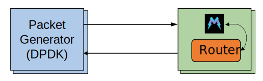

# Router tests
This folder contains the files required to run the test involving the `Router` service.

<p align="center">

</p>

There are two way to execute this test:

1. [Automatic test](#automatic-test-with-ssh-connection)
2. [Manual test](#manual-test)

## Automatic test (with SSH connection)
This is the preferred method to execute this test. The script automatically connects (via *SSH*) to the *DUT* and performs the configuration.
In addition, it executes the packet generator and replay the PCAP traces with different localities.
All the results are stored in the [`result`](./result) folder, and can be used to generate the final figures.

To run this test, follow these steps:

1. Make sure the Morpheus repo is cloned on both **pktgen** and **DUT** machine.
2. Modify the [`config.sh`](../config.sh) script with all the information requested, which are specific to your testbed.
3. Log into the **pktgen** server and go into this folder
4. Execute this command:

```console
$ chmod +x start_throughput_test.sh
$ ./start_throughput_test.sh -r <number_of_runs> # by default, this is set to 5
```

While the test is running, you can see the output of **Morpheus** by logging into the *DUT* and executing this command:

```console
$ tmux attach -d -t morpheus
```

5. Once the test is completed, you can see the output under the results folder. Every time you execeute the script, a different folder with the current date is created.

## Manual test
If you are brave enough, and you want to execute the test manually, you can follow these steps:

1. Same as step 1 of [Automatic test](#automatic-test-with-ssh-connection)
2. Same as step 2 of [Automatic test](#automatic-test-with-ssh-connection)
3. Log into the **DUT** server and go into this folder
4. Execute this command:

```console
$ chmod +x start_throughput_test_dut.sh
$ ./start_throughput_test_dut.sh <-m> # the -m flag is used to enable or disable Morpheus
```

5. After the configuration is completed, log into the **pktgen** server and execute this command:

```console
$ chmod +x start_throughput_test_pktgen.sh
$ ./start_throughput_test_pktgen.sh -t <test_name> -o <output_file_name>
$ # The supported test names are "high_loc", "low_loc" and "no_loc"
```

6. The results for this test are placed under the [`result`](./result) folder with the name you have specified.
